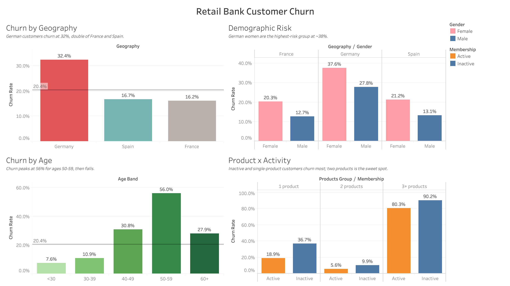

# Retail Bank Customer Churn Analysis

A customer-retention analysis framework on **10,000 retail-bank customers**
across France, Spain and Germany, quantifying how demographics, product adoption
and account activity relate to attrition — and which cohorts the bank should
prioritise for retention.

**Stack:** Python (pandas) for cleaning and feature engineering · DuckDB as a
local analytical warehouse · SQL for the analysis layer · Tableau for the
interactive dashboard · matplotlib/seaborn for exploratory charts in the
notebook.

## Headline findings

| Finding | Evidence |
|---|---|
| **Germany is the priority cohort.** German customers churn at **32.4%** — roughly double France (16.2%) and Spain (16.7%) — while holding the *highest* balances (~120k vs ~62k), so the bank loses its most valuable customers fastest. | `sql/02_churn_by_geography.sql` |
| **Inactivity nearly doubles churn.** Inactive members churn at **26.9%** vs **14.3%** for active ones — the most controllable lever the bank has. | `sql/03_products_and_activity.sql` |
| **Product count is U-shaped and extreme.** Single-product customers churn **27.7%** vs **7.6%** at two products; the small 3–4 product cohorts churn 80–100%. | `sql/03_products_and_activity.sql` |
| **Age churn peaks mid-life, and women churn more.** Churn peaks at **56%** in the 50–59 band (not the oldest), and women churn **25.1%** vs men **16.5%**. | `sql/04_demographics.sql` |

## Dashboard

An interactive Tableau dashboard ties the findings together — churn by
geography, product/activity, demographics and balance — with a shared filter to
re-slice every view at once. Build notes (calculated fields, worksheet layout)
are in [`tableau/DASHBOARD.md`](tableau/DASHBOARD.md).

<!-- After publishing to Tableau Public, add the live link and a preview image here:
[**▶ Explore the live dashboard**](LINK)

-->

## Recommendations

1. **Lead retention with Germany.** It has the highest churn *and* the highest
   balances, so each lost customer costs more — concentrate retention budget here
   first, especially on women (German women churn 37.6%).
2. **Re-activate dormant members.** Inactive customers churn at nearly twice the
   active rate; an engagement/re-activation programme targets the single most
   controllable driver in the data.
3. **Cross-sell single-product customers to a second product.** Two-product
   customers sit in the lowest churn band (7.6%); moving one-product customers up
   is associated with far lower attrition.
4. **Investigate the 3+ product cohort.** Near-total churn among the most
   heavily-sold customers looks like a mis-sell or service problem, not loyalty —
   worth a qualitative review rather than more cross-selling.

## Repository structure

```
├── data/
│   ├── raw/Churn_Modelling.csv         # source extract (10,000 customers)
│   └── README.md                       # data dictionary + quality notes
├── notebooks/
│   └── 01_exploratory_analysis.ipynb   # executed EDA walkthrough
├── sql/                                # analysis layer, one question per file
├── src/
│   ├── download_data.py                # (re)fetch the raw extract
│   ├── prepare_data.py                 # clean + build DuckDB warehouse
│   ├── run_analysis.py                 # run sql/ -> outputs/tables/
│   └── export_tableau.py               # dashboard extracts
├── outputs/
│   └── tables/                         # query results (CSV)
└── tableau/
    ├── extracts/                       # Tableau-ready data
    └── DASHBOARD.md                    # dashboard design & build notes
```

## Getting started

**Prerequisites:** Python 3.10+ and `pip`. (Tableau Desktop or the free
[Tableau Public](https://public.tableau.com) is only needed to rebuild the
dashboard.)

**1. Clone the repository**

```bash
git clone https://github.com/<your-username>/retail-bank-customer-churn-analysis.git
cd retail-bank-customer-churn-analysis
```

**2. (Optional) create a virtual environment**

```bash
python -m venv .venv
source .venv/bin/activate        # Windows: .venv\Scripts\activate
```

**3. Install dependencies**

```bash
pip install -r requirements.txt
```

**4. Run the pipeline**

The raw dataset is already included, so you can run the steps in order:

```bash
python src/prepare_data.py     # clean data, build data/churn.duckdb
python src/run_analysis.py     # run all SQL queries -> outputs/tables/*.csv
python src/export_tableau.py   # regenerate the Tableau extracts
```

Query results land in `outputs/tables/` and dashboard-ready files in
`tableau/extracts/`. To explore the analysis interactively (with charts), open
`notebooks/01_exploratory_analysis.ipynb`.

> The raw CSV ships with the repo. If you ever need to re-fetch it from source,
> run `python src/download_data.py`.

## Methodology notes

- **Clean extract:** no missing values and no duplicate customers — the work is
  in framing and feature engineering, not repair.
- **Identifiers dropped:** `RowNumber`, `CustomerId` and `Surname` carry no
  analytical signal and are removed from the analysis table (kept in the
  `raw_customers` audit table).
- **`Balance = 0`** (~36% of customers) is a real state, not missing data; it is
  flagged, and notably these customers churn *less*, not more — balance partly
  proxies for country.
- **Small cohorts:** the 3–4 product groups (≈300 and ≈60 customers) churn at
  80–100% but are reported with their sample sizes, not as headline rates.
- **Cross-sectional, not survival:** the data is a snapshot with no event date,
  so this is a "who has churned" analysis, not time-to-churn modelling.

## Data source

Bank Customer Churn ("Churn Modelling") dataset — 10,000 retail-bank customers,
widely available on Kaggle for churn analysis.
